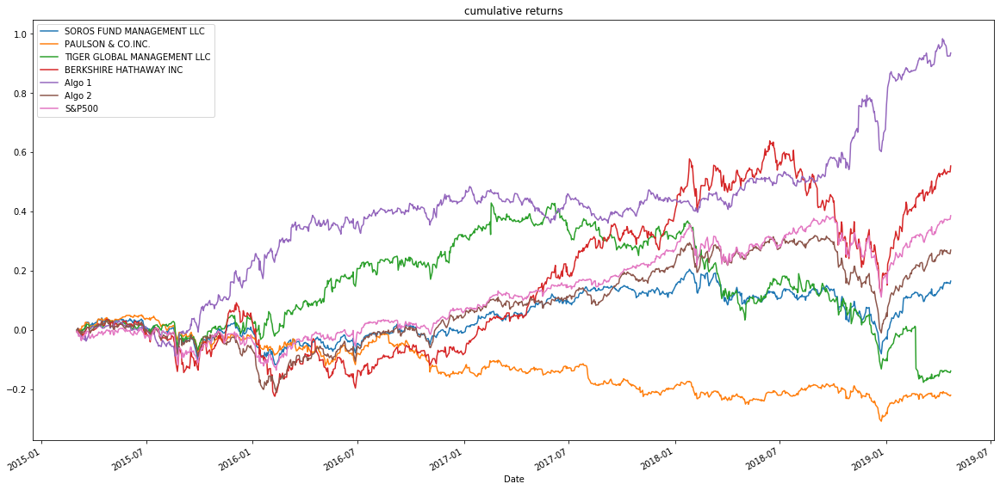
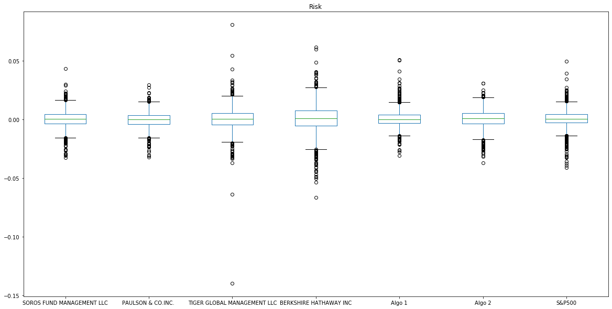
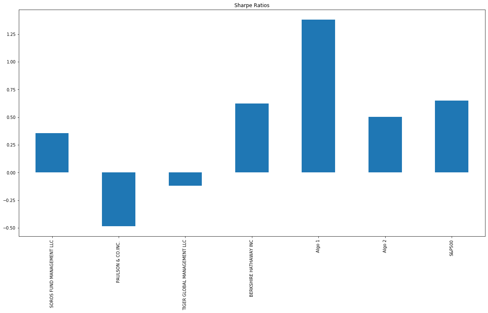

# Pandas Portfolio Analysis
_Conducting portfolio analysis using Pandas dictionaries._ 

## Background
In this assignment, I applied quantitative analysis techniques with Python and Pandas to determine which investment portfolio is performing the best across many areas: volatility, returns, risk, and Sharpe ratios.

# Performance
##  Does any portfolio outperform the S&P 500?
- Algo 1 and BERKSHIRE HATHAWAY INC outperformed S&P500

# Risk
## Determine which portfolios are riskier than the S&P 500?
- TIGER GLOBAL MANAGEMENT LLC and BERKSHIRE HATHAWAY INC are risker than S&P 500

## On the basis of this performance metric, do our algo strategies outperform both 'the market' and the whales? 
- Yes

 
